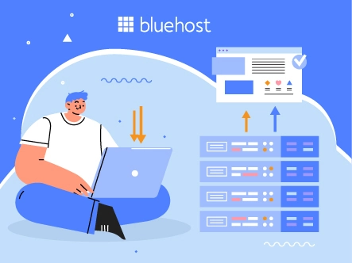
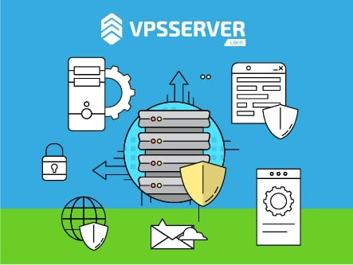

# 2025年最值得选择的9家SSD VPS主机服务商

如果你的网站还在用传统HDD硬盘，那访问速度可能已经在流失潜在客户了。SSD固态硬盘的出现改变了这一切——更快的加载速度意味着访客不会因为等待而离开，文件传输也能在瞬间完成。对于需要稳定性能和极速响应的业务来说，SSD VPS主机已经成为明智之选。本文将带你了解什么是SSD VPS主机，以及2025年市场上最靠谱的9家服务商。

---

## 什么是SSD VPS主机？

VPS（虚拟专用服务器）主机，就是在一台物理服务器上给你划分出一块独立空间，配备专属资源来运行你的网站。你能享受到接近独立服务器的性能和隐私保护，但成本要低得多。

当VPS主机使用SSD固态硬盘作为存储设备时，就是我们说的SSD VPS主机。相比传统机械硬盘，SSD的读写速度能快上好几倍，这意味着你的网站、数据库查询、文件操作都会明显提速。

## 2025年最佳SSD VPS主机服务商

经过实测和对比，我们整理出以下9家在性能、价格和服务上都表现出色的VPS主机商：

### 1. Kamatera – 30天免费试用，老牌稳定

Kamatera成立于1995年，在行业里摸爬滚打超过25年。他们提供即时部署、灵活配置和持续创新的服务。最吸引人的是30天免费试用——你可以零成本体验他们的服务质量。

**核心优势：**
- **高速SSD存储**：采用最新硬件技术，确保数据读写速度
- **99.95%在线率保证**：网站几乎不会掉线
- **全球数据中心**：覆盖美国、以色列、欧洲、加拿大和亚洲，让你的网站离用户更近

如果你在寻找稳定可靠的VPS主机，想要在正式付费前充分测试服务质量，👉 [Vultr的30天免费试用能让你零风险体验企业级SSD VPS性能](https://www.vultr.com/?ref=9738262-9J)，全球多个数据中心任你选择。

### 2. LiquidWeb – 专注性能的托管式VPS

LiquidWeb的团队有超过250名专业工程师和技术人员，专门为中高流量网站、在线商店和应用提供托管服务。他们的SSD VPS结合了专用服务器的性能和云主机的灵活性。

**主要特点：**
- **托管式VPS**：自动更新、维护和优化，你只需专注业务
- **内置防火墙和DDoS防护**：保障网站安全
- **Cloudflare CDN集成**：全球加速，提升访问速度
- **随时扩展**：流量增长时可快速升级配置

**价格方案：**

| 2GB RAM | 4GB RAM | 8GB RAM | 16GB RAM |
|---------|---------|---------|----------|
| 2核CPU | 4核CPU | 8核CPU | 8核CPU |
| 40GB SSD | 100GB SSD | 150GB SSD | 200GB SSD |
| 10TB流量 | 10TB流量 | 10TB流量 | 10TB流量 |
| $25/月 | $35/月 | $45/月 | $105/月 |

### 3. YouStable – 印度性价比之王

YouStable自2015年起就以极具竞争力的价格在印度市场站稳脚跟。他们提供完整的root权限，支持自选操作系统和控制面板，特别适合预算有限但需要高性能的用户。

**核心功能：**
- **NVMe SSD硬盘**：比普通SSD还要快的存储技术
- **免费Let's Encrypt SSL证书**：保护网站数据安全
- **免费网站迁移**：从其他主机商无缝转移
- **24/7全天候支持**：电话、在线聊天、工单和邮件多渠道服务

### 4. Hosting.com – 20倍速度提升

Hosting.com（前身为A2 Hosting）从2003年开始就专注VPS主机业务。他们的Turbo加速技术能让网站速度提升20倍，99.9%的在线率承诺也很有说服力。

**关键优势：**
- **Turbo加速模式**：更好的SEO排名和用户体验
- **99.9%在线率保证**：网站稳定运行
- **免费账户迁移**：大多数情况下免费帮你搬家

**价格参考：**

| Lift 4 | Lift 8 | Lift 16 | Mach 8 |
|--------|--------|---------|--------|
| 2核CPU全核心 | 4核CPU全核心 | 8核CPU全核心 | 16核CPU全核心 |
| 4GB内存 | 8GB内存 | 16GB内存 | 32GB内存 |
| 80GB存储 | 160GB存储 | 320GB存储 | 640GB存储 |
| $39/月 | $38.50/月 | $40.50/月 | $55.50/月 |

### 5. Bluehost – WordPress用户的首选

Bluehost成立于2003年，总部位于犹他州。他们为全球数百万用户提供服务，特别擅长WordPress主机。如果你的网站是基于WordPress搭建的，Bluehost的优化配置会让你省心不少。

**特色功能：**
- **无限域名和网站托管**：一个账户管理所有网站
- **专用资源**：CPU、内存、存储都是你独享
- **简洁控制面板**：新手也能快速上手
- **SSD固态硬盘**：确保WordPress网站流畅运行

**价格方案：**

| 标准版 | 增强版 | 旗舰版 |
|--------|--------|--------|
| 2核CPU | 2核CPU | 4核CPU |
| 2GB内存 | 4GB内存 | 8GB内存 |
| 30GB SSD | 60GB SSD | 120GB SSD |
| 1TB流量 | 2TB流量 | 3TB流量 |
| $19.99/月 | $29.99/月 | $59.99/月 |

### 6. Vultr – 新用户送$50体验金

Vultr提供按小时计费的灵活方案，支持弹性扩展存储空间。他们的Block Storage采用高性能NVMe SSD，特别适合需要大量IO操作的应用。

**亮点功能：**
- **API管理**：通过API快速创建和管理VPS实例
- **按需扩展**：随时增减存储空间，只付使用费
- **高性能SSD**：企业级NVMe固态硬盘
- **三重冗余架构**：数据安全有保障

**价格示例：**

| $12/月 | $26/月 | $50/月 | $96/月 |
|--------|--------|--------|--------|
| 1GB内存 | 2GB内存 | 4GB内存 | 8GB内存 |
| 1核CPU | 1核CPU | 2核CPU | 4核CPU |
| 25GB存储 | 50GB存储 | 80GB存储 | 160GB存储 |
| 1TB流量 | 2TB流量 | 4TB流量 | 5TB流量 |

当你需要稳定且高性能的VPS部署环境时，尤其是对全球节点覆盖有要求的项目，👉 [Vultr新用户可获得$50免费额度来测试他们的SSD VPS服务](https://www.vultr.com/?ref=9738262-9J)，全球32个数据中心随你挑选，按小时计费更灵活。

### 7. VPSServer – 三重存储保护

VPSServer使用三路存储技术，你的数据会同时保存在三台独立服务器上。这意味着即使某台服务器出现硬件故障，你的VPS也不会受影响。他们在全球有15个以上的数据中心位置。

**核心优势：**
- **三重备份**：数据安全性极高
- **Intel E5处理器**：企业级性能
- **40Gbps网络连接**：超高带宽
- **DDoS防护**：自动检测和拦截攻击

**基础价格：**

| VPS 1GB | VPS 4GB | VPS 8GB |
|---------|---------|---------|
| 1核CPU | 4核CPU | 8核CPU |
| 20GB SSD | 80GB SSD | 160GB SSD |
| 500GB流量 | 2TB流量 | 4TB流量 |
| $3.99/月 | $15.99/月 | $31.99/月 |

### 8. InterServer – 首月仅需$0.01

InterServer成立于1999年，以其创新技术和优质服务在业内站稳脚跟。他们的最大卖点是首月仅需1美分的超低价体验，让你几乎零成本试用VPS服务。

**主要特点：**
- **完全控制权**：Full root访问权限
- **快速加载速度**：采用顶级硬件配置
- **专用资源**：CPU、内存、存储独享
- **全方位安全防护**：DDoS防护、防火墙、反恶意软件

**价格方案：**

| $6/月 | $12/月 | $18/月 | $24/月 |
|-------|--------|--------|--------|
| 1核CPU | 2核CPU | 3核CPU | 4核CPU |
| 2GB内存 | 4GB内存 | 6GB内存 | 8GB内存 |
| 30GB SSD | 60GB SSD | 90GB SSD | 120GB SSD |
| 2TB流量 | 4TB流量 | 6TB流量 | 8TB流量 |

### 9. GreenGeeks – 环保型主机

GreenGeeks团队有超过40年的行业经验。他们的特色是"绿色主机"——用风能抵消网站消耗的能源，实际抵消量是消耗的3倍。如果你在意环保，这是个不错的选择。

**核心功能：**
- **SSD存储**：文件存储在高速固态硬盘阵列上
- **无限流量**：不限制带宽使用
- **拖拽式网站构建器**：零技术门槛建站
- **免费网站迁移**：专业团队帮你搬家
- **30天退款保证**：不满意全额退款

**价格参考：**

| VPS 2GB | VPS 4GB | VPS 8GB |
|---------|---------|---------|
| 2GB内存 | 4GB内存 | 8GB内存 |
| 50GB SSD | 75GB SSD | 150GB SSD |
| 10TB流量 | 10TB流量 | 10TB流量 |
| $39.95/月 | $59.95/月 | $109.95/月 |

## 选择SSD VPS主机前要注意什么

在决定购买之前，这些因素值得你仔细考虑：

- **托管方式**：如果你懂技术，可以选择非托管型省钱；如果想专注业务，托管型会帮你处理所有技术细节
- **虚拟化技术**：KVM、OpenVZ等不同技术影响性能和隔离度
- **弹性扩展**：流量突然增长时能否快速升级配置
- **控制面板**：cPanel、DirectAdmin等是否符合你的使用习惯
- **Root权限**：是否提供完整的服务器控制权
- **操作系统**：Linux、Windows或其他系统的支持情况
- **技术支持**：24/7客服是否真正靠谱，响应速度如何
- **存储类型**：SSD或NVMe SSD，后者速度更快

## SSD VPS主机的优缺点

**优势：**
- 读写速度比HDD快5-20倍
- 网站加载时间明显缩短，用户体验更好
- 数据库查询响应更快
- 更低的故障率和更长的使用寿命
- 能耗更低，发热量小

**劣势：**
- 价格比传统HDD主机略高（但差距在缩小）
- 存储容量相同情况下成本稍高
- 写入次数有理论上限（但正常使用下几乎不会遇到）

## 常见问题解答

**SSD VPS主机适合什么类型的业务？**

适合对速度有要求的各类网站：电商平台、企业官网、高流量博客、在线应用等。如果你的网站访问量在增长，或者用户体验对业务很关键，SSD VPS是性价比很高的选择。

**能找到免费的SSD VPS吗？**

完全免费的几乎不存在，因为SSD硬件成本和服务器维护都需要开支。但很多服务商提供免费试用期，比如Kamatera的30天试用、Vultr的$50体验金，让你可以先测试再决定。

**哪家SSD VPS服务商最好？**

这取决于你的具体需求。如果追求稳定和试用期，Kamatera是好选择；预算有限选YouStable；需要托管服务选LiquidWeb；WordPress用户选Bluehost。没有绝对最好，只有最适合。

---

## 总结

SSD VPS主机是介于共享主机和独立服务器之间的理想选择。你能以合理的价格获得专属资源和高速性能，特别适合正在成长中的网站。

如果你的网站需要更快的加载速度、更稳定的运行环境，又不想为独立服务器支付高昂费用，SSD VPS就是为你准备的。以上9家服务商各有特色，根据自己的预算和需求选择合适的即可。

对文章内容还有疑问？随时提出来，我们很乐意为你解答！
